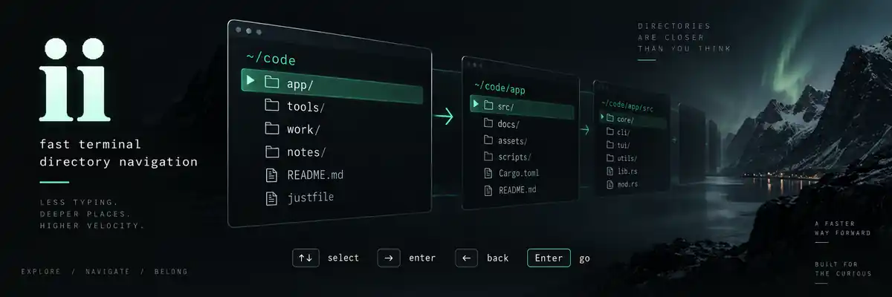

<p align="center">
  
</p>

<h1 align="center">ii</h1>
<p align="center"><strong>Two taps. Any directory.</strong><br>A small, native Rust navigator for the space between <code>cd</code> and <code>ls</code>.</p>
<p align="center">
  <a href="https://github.com/Mik-pe/ii/actions/workflows/ci.yml"></a>
  <a href="LICENSE"></a>
</p>

```text
$ ii

 ii   ~/code
 / type to filter
 ╭─ FOLDERS ───────────────────────╮╭─ NEXT → ───────────────────╮
 │ › app/                         ││ app                        │
 │   notes/                       ││   assets/                  │
 │   tools/                       ││   docs/                    │
 │                                ││   src/                     │
 ╰────────────────────────────────╯╰────────────────────────────╯
 ↑↓ select   → open   ← up   Enter cd here   Tab cd selected
```

Stop typing `cd app`, `ls`, `cd src`, `ls`. Open `ii`, walk the directory tree with the arrow keys, and return to your shell exactly where you want to be. The name comes from Swedish **in i** — “into.”

**Directories, not distractions.** No file operations, file previews, background daemon, whole-disk index, network requests, or configuration ceremony. The banner is cover art; the interface above illustrates the actual directory-only layout.

## Install

Install from this repository with a current stable Rust toolchain:

```sh
cargo install --git https://github.com/Mik-pe/ii --locked
```

Make sure Cargo's binary directory is on your `PATH`. This project is not currently published on crates.io; use the Git installation above rather than `cargo install ii`. CI also produces platform-specific build archives with SHA-256 checksums; these are development builds, not a tagged stable release.

### Connect your shell

A child process cannot change the working directory of its parent shell. Install the small shell function once, so `ii` can navigate **and** leave your prompt in the destination directory.

**Bash** — add to `~/.bashrc`, or run it in the current session:

```sh
eval "$(ii init bash)"
```

**Zsh** — add to `~/.zshrc`:

```sh
eval "$(ii init zsh)"
```

**Fish** — add to `~/.config/fish/config.fish`:

```fish
ii init fish | source
```

**PowerShell 7 on Windows** — add to `$PROFILE`:

```powershell
ii init powershell | Out-String | Invoke-Expression
```

Then just type:

```sh
ii             # Start here.
ii ~/code      # Start somewhere else.
ii --no-preview
```

The setup command evaluates only the shell integration emitted by the installed binary. Directory names are **never evaluated as shell code**.

## Muscle memory

| Key | Action |
| --- | --- |
| **↑ / ↓** | Select a directory. |
| **→** | Open the selected directory. |
| **←** | Go up, keeping the directory you just left selected. |
| **Enter** | Finish in the current directory shown in the header. |
| **Tab** | Open the selected directory and finish there. |
| **Type** | Fuzzy-filter the current directory immediately. |
| **Backspace** | Erase a grapheme; go up when the filter is empty. |
| **Esc** | Clear the filter; when empty, cancel without changing directory. |
| **Ctrl-C / Ctrl-D** | Cancel immediately. |
| **.** | Toggle hidden directories when the filter is empty. |
| **Ctrl-U** | Clear the filter. |
| **Ctrl-L** | Refresh the current directory. |
| **Ctrl-G** | Go to the home directory. |
| **Home / End** | Select the first / last directory. |
| **PageUp / PageDown** | Move by a page. |
| **Ctrl-N / Ctrl-P** | Alternative down / up bindings. |
| **? / F1** | Open or close help. |

`Enter` always means **“take my shell here”**, never “maybe open this folder.” Use `→` to explore and `Tab` for the one-key selected-folder shortcut. An Enter pressed while a directory is loading is remembered rather than discarded.

Selection is remembered within a navigation session. Returning to a parent or revisiting a directory does not throw you back to the first row. Selection is deterministic; there is no hidden prediction model or persistent visit database.

Every ordinary letter is available for filtering, including `q`, `h`, `j`, `k`, and `l`. Filtering matches case-insensitive subsequences: `tl` can find `tools`. It is local to the current directory, not recursive search. To find `.git`, press `.` to show hidden directories and then type `git`. A pasted filter starting with `.` also reveals matching hidden directories.

## Small interface, deliberate behavior

The UI uses a compact, mint-accented layout in the terminal's alternate screen. On wide terminals, a right-hand pane shows the selected directory's subdirectories before you open it. Below 90 columns, that pane disappears. `--no-preview` keeps a single pane at any width. Vertical spacing contracts in short terminal windows. No Nerd Font is required.

The previous terminal screen, cursor, and raw-mode settings are restored on normal exit, cancellation, and panic. Unix termination signals are handled too; an uncatchable `SIGKILL` cannot be cleaned up by any program.

```text
-a, --hidden      Show hidden directories
    --no-preview  Disable the next-directory pane
    --no-color    Use terminal defaults and reverse-video selection
    --print0      Write a NUL-terminated path for scripts
-h, --help        Show help
-V, --version     Show version
    --            Interpret the next argument as a path, even with a leading -
```

A nonempty `NO_COLOR` environment variable also disables the custom palette. Empty directories, unreadable directories, broken symlinks, and no-match filters have explicit states rather than silent failures.

## Built for responsiveness

`ii` scans one directory at a time. Normal files are ignored without extra metadata calls; only symlinks need a target check. Navigation and previews use separate worker threads, so a slow preview cannot hold up the navigation worker. Obsolete requests are replaced rather than accumulated.

Recent directory listings are cached with bounds on both directory count and entry count, then revalidated when revisited. A preview is debounced while you move the selection. Rendering builds only the visible rows and redraws only after a relevant event, not continuously while idle.

These are implementation choices, not a guarantee of a particular latency on every disk. Remote filesystems can still block inside an operating-system call. The interface remains cancellable, but the navigation worker may have to wait for that call to return.

Measure on your own machine:

```sh
cargo bench --locked --bench navigation
```

The benchmark reports median and p95 for a single-level scan and a 10,000-name subsequence-matching workload. It does not measure end-to-end keypress latency or claim a comparison with other tools. [Initial measurements and methodology](docs/PERFORMANCE.md) are documented separately.

## Shell protocol and path safety

The interactive UI is written to **stderr**. On a successful selection the binary writes only the selected absolute path to **stdout**, with **no appended newline**. `--print0` appends NUL instead. Cancellation writes no path and exits with status `130`; runtime errors use `1`, argument errors `2`.

Bash and Zsh use a sentinel to preserve trailing newlines in Unix names. Fish uses NUL-delimited output. Paths are passed to `cd` as one quoted argument. PowerShell uses `Set-Location -LiteralPath`, not wildcard expansion. Its integration targets Windows; unusual Unix newline-containing paths should use Bash, Zsh, or Fish.

On Unix, the selected path's original bytes are preserved even when the name is not UTF-8 and the underlying filesystem permits such names. Escaped display labels never replace the filesystem path. Control characters and directional formatting controls are escaped before rendering.

The shell function handles cancellation as a successful no-op. To bypass that function and access the raw binary protocol in Bash/Zsh/Fish, use `command ii`.

## Develop

```sh
cargo fmt --all -- --check
cargo clippy --locked --all-targets -- -D warnings
cargo test --locked --all-targets
cargo run --release -- ~/code
```

CI builds and tests on Linux, macOS, and Windows. Unix pseudo-terminal tests exercise real key events, selected-path output, cancellation, and terminal restoration. Separate shell tests exercise Bash, Zsh, and Fish with quoting, Unicode, trailing newlines, and error handling. The Windows interactive console is not covered by the Unix PTY harness.

See [architecture](docs/ARCHITECTURE.md) for the boundaries and invariants, and [contributing](CONTRIBUTING.md) for the change checklist. This is an initial implementation; broader real-terminal testing should precede a stable release.

## License

[MIT](LICENSE).
