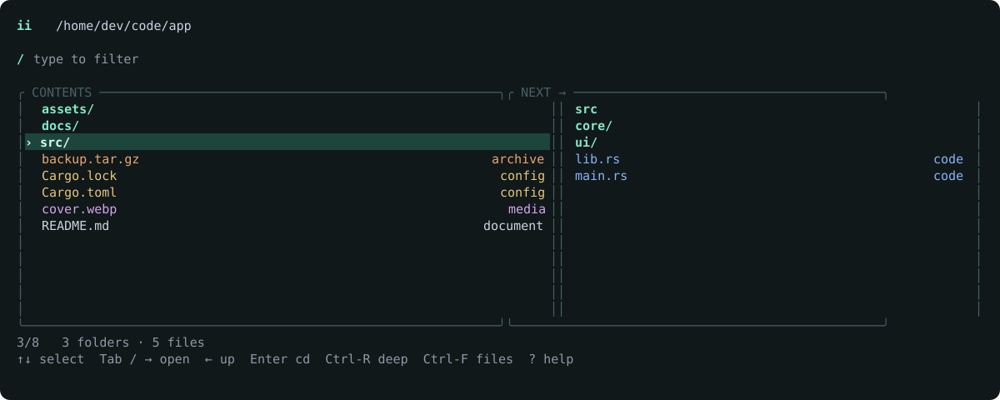

<p align="center">
  
</p>

<h1 align="center">ii</h1>
<p align="center"><strong>Two taps. Any directory.</strong><br>A small, native Rust navigator for the space between <code>cd</code> and <code>ls</code>.</p>
<p align="center">
  <a href="https://github.com/Mik-pe/ii/actions/workflows/ci.yml"></a>
  <a href="LICENSE"></a>
</p>

Stop typing `cd app`, `ls`, `cd src`, `ls`. Open `ii`, see the folders **and files**, walk the directory tree with the arrow keys, and return to your shell where you want to be. The name comes from Swedish **in i** — “into.”

<p align="center">
  
</p>

The second image is rendered by the actual UI code with generic fixture data, not a design mockup. Your terminal's font and default background may differ. The first image is cover art.

**See more. Navigate just as directly.** No file operations, file-content previews, background daemon, whole-disk index, or network requests.

## Install

Use a current stable Rust toolchain:

```sh
cargo install --git https://github.com/Mik-pe/ii --locked
```

Make sure Cargo's binary directory is on your `PATH`. To update an existing installation, run the same command with `--force`. This repository is not distributed through `cargo install ii`; use the Git URL above. CI also produces platform-specific development archives with SHA-256 checksums, not a tagged stable release.

### Connect your shell

A subprocess cannot change its parent shell's working directory. Install the small shell function once so `ii` leaves your prompt in the destination directory.

**Bash** — add to `~/.bashrc`, or run in the current session:

```sh
eval "$(ii init bash)"
```

**Zsh** — add to `~/.zshrc`:

```sh
eval "$(ii init zsh)"
```

**Fish** — add to `~/.config/fish/config.fish`:

```fish
ii init fish | source
```

**PowerShell 7 on Windows** — add to `$PROFILE`:

```powershell
ii.exe init powershell | Out-String | Invoke-Expression
```

Use **`ii.exe` for the initial PowerShell setup**: PowerShell already defines `ii` as an alias for `Invoke-Item`. The integration removes that alias in the current/global scope and defines the navigator function. The original command remains available as `Invoke-Item`.

```sh
ii                    # Start here, with folders and files visible.
ii ~/code             # Start somewhere else.
ii --dirs-only        # Start with just folders; Ctrl-F brings files back.
ii --no-preview       # Always use one pane.
```

Setup evaluates only the shell integration emitted by the installed binary. Directory names are **never evaluated as shell code**.

## Start at a real location

`ii ..` starts at the parent directory, not a path ending in `/..`. `ii ../..` and `ii ./app/../docs` are resolved before child paths are built, so the header, parent navigation, cache and output agree. Resolution runs on the filesystem worker, not the input thread.

Ordinary absolute paths preserve directory-symlink aliases. On POSIX, inputs containing `..` use the filesystem to resolve the physical parent, including `symlink/..`; this is not shell-specific logical `$PWD` rewriting. Windows uses native absolute-path rules. Missing or invalid locations report errors rather than producing a fake destination.

## Go deep only when you ask

Press **Ctrl-R**, type a folder name or relative-path subsequence, select a result, and use **Tab** or **→** to enter it inside the UI. Then press **Enter** to change your shell directory. For example, `server/api` can find `app/server/services/api`. Relative result paths distinguish equally named directories.

Ctrl-R can extend an existing local filter into a deep search. **Esc**, **Left**, or Ctrl-R returns to the local view with its previous filter and selection. **Ctrl-L** retries. Enter always confirms the header directory, **not** a highlighted search result; navigate into the result first. Deep search finds directories only; normal browsing still shows colored files.

The worker is created only after a nonempty deep query survives a **100 ms debounce**. Ordinary startup, filtering, arrow navigation, and an empty deep query start no recursive scan or index. Results arrive incrementally; changing the query or leaving search invalidates old results immediately. Search has its own worker, and the deep view does not launch previews.

Queries are bounded: **200 displayed results, 100,000 inspected entries, 10,000 directories, depth 32, 4,096 pending directories, and a 2-second cooperative time budget**. Limited searches say so. Navigate to a narrower root and retry to explore omitted branches. An operating-system filesystem call can block beyond that budget; input and cancellation remain separate, but filesystem contention is not a zero-latency guarantee.

Traversal skips hidden subtrees unless hidden entries are enabled. It does not deliberately follow symlinks, and prunes descendants of `.git`, `.hg`, `.svn`, `node_modules`, `target`, `.venv`, `venv`, `__pycache__`, and `.cache`. Those roots can still match when visible; navigate into one to search it explicitly. These are fixed exclusions, **not full `.gitignore` support**. No file contents are read and nothing is persisted. This is a navigator, not a filesystem sandbox: concurrent directory replacement can race with traversal.

## Files as context, not distractions

Directories always come first, including during filtering. Within each group, entries are sorted case-insensitively; filtering ranks fuzzy matches within that group. A file match never displaces a matching directory above it.

| Entry | Color | Cue beyond color |
| --- | --- | --- |
| Directory | Mint green, bold | Trailing `/` |
| Source code and scripts | Blue | `code` |
| Configuration and lockfiles | Warm yellow | `config` |
| Documentation and documents | Pale gray | `document` |
| Images, audio, and video | Lilac | `media` |
| Archives | Orange | `archive` |
| Other files | Neutral gray | `file` |
| Unresolved symbolic link | Rose | `↗!` and `unresolved link` |

Categories are inferred from names/extensions, not file contents or executable permissions. Symlinks keep a `↗` marker and their original alias paths. Sockets, devices, and other special entries are labeled `special`. An unresolved link may be broken **or inaccessible**; the UI does not pretend to know which.

File-type labels appear when the list is wide enough. The wide detail pane repeats the selected file's category. Long names keep both their prefix and extension where space permits. `--no-color` or a nonempty `NO_COLOR` disables the palette; directory suffixes, labels, and reverse-video selection remain.

Files can be selected and filtered, but **Right and Tab never open, execute, or try to `cd` into them**. A small hint explains the available action. **Enter still changes to the directory in the header**, even with a file selected. File details do not read the file's contents.

**Ctrl-F** instantly switches between the mixed list and folders only, without a new scan. It preserves a selected directory and the current filter. Hiding a selected file safely selects the first remaining match. The same visibility setting applies to the next-directory pane.

## Muscle memory

| Key | Action |
| --- | --- |
| **↑ / ↓** | Select a folder or file. |
| **→** | Open the selected **directory**. |
| **←** | Go up and reselect the directory you just left. |
| **Enter** | Finish in the current directory shown in the header. |
| **Tab** | Open the selected **directory** inside the UI, just like **→**. |
| **Type** | Fuzzy-filter folders and files immediately. |
| **Ctrl-F** | Show / hide files. |
| **Ctrl-R** | Toggle explicit descendant-folder search. |
| **Backspace** | Erase a grapheme; go up when the filter is empty. |
| **Esc** | Clear the filter; otherwise cancel without a directory change. |
| **Ctrl-C / Ctrl-D** | Cancel immediately. |
| **.** | Toggle hidden entries when the filter is empty. |
| **Ctrl-U / Ctrl-L / Ctrl-G** | Clear filter / refresh directory / go home. |
| **Home / End** | First / last visible entry. |
| **PageUp / PageDown** | Move by a page. |
| **Ctrl-N / Ctrl-P** | Alternative down / up bindings. |
| **? / F1** | Toggle help. |

**Enter is the only key that confirms a directory change in your shell.** Both `→` and `Tab` open the selected directory inside the UI and let you keep browsing. They never exit, and do nothing to files. After any number of navigation steps, `Esc` still cancels without changing the shell directory. An Enter pressed while a directory loads is remembered; navigation keys never queue a finish.

Selection is remembered within the session, including when returning to a parent or revisiting a directory. There is no persistent history or hidden prediction model.

Every ordinary letter remains available for filtering, including `q`, `f`, `h`, `j`, `k`, and `l`. For example, `tl` matches `tools` and `mnrs` can match `main.rs`. Ordinary filtering stays local. **Ctrl-R** explicitly switches to descendant-folder search. To find `.git`, press `.` to show hidden entries and type `git`. A pasted dot-prefixed filter also reveals matching hidden entries.

## Small interface, deliberate behavior

The compact, mint-accented UI uses the terminal's alternate screen. At 90 columns or wider, the right-hand pane shows the selected directory's contents, or a selected file's name/category. Below that width it disappears. `--no-preview` disables it entirely. Vertical spacing contracts in short windows. No Nerd Font is required. Deep search uses the full list width to display relative paths without launching preview reads.

Status counts distinguish visible folders, files, and special entries. Keyboard hints adapt to the selected entry: a file does not advertise a directory-opening action.

```text
-a, --hidden      Show hidden entries
    --dirs-only   Start with files hidden; Ctrl-F toggles
    --no-preview  Disable the next-directory / detail pane
    --no-color    Use terminal defaults and reverse-video selection
    --print0      Write a NUL-terminated path for scripts
-h, --help        Show help
-V, --version     Show version
    --            Treat the next argument as a path, even with a leading -
```

Terminal screen, cursor, and raw-mode settings are restored on normal exit, cancellation, and panic. Unix termination signals request orderly cleanup; an uncatchable `SIGKILL` cannot be cleaned up by any program.

## Built for responsiveness

Single-level scans run outside the input thread. Ordinary files are classified by name without extra metadata reads or content reads; symlinks need a target-type check. Navigation and directory previews use separate workers, and obsolete requests are replaced rather than queued. Selecting a file does not start a scan of that file.

Recent listings are cached with bounds on both listing count and entry count, then revalidated when revisited. Preview reads are debounced while the selection moves. Rendering builds only visible rows and redraws only after state changes. Counts are updated with the filter/list, not by rescanning all entries on each arrow key.

Showing files necessarily constructs and sorts more entries than a directory-only scan. Filesystem calls on remote mounts may still block a worker until the OS returns; input and cancellation stay on the UI thread. These choices are not a universal latency guarantee.

```sh
cargo bench --locked --bench navigation
```

[Measurements and methodology](docs/PERFORMANCE.md) distinguish listing scans from matching, startup, and keypress latency. They do not claim a comparison with other tools.

## Shell protocol and path safety

The UI goes to **stderr**. Success writes only the selected absolute **directory** path to **stdout**, without an appended newline; `--print0` appends NUL. Cancellation writes no path and exits `130`; runtime errors use `1`, invalid arguments `2`. The shell function treats cancellation as a successful no-op.

Bash/Zsh use a sentinel to preserve trailing newlines in Unix directory names. Fish uses NUL-delimited output. `cd` receives one quoted argument. PowerShell uses `Set-Location -LiteralPath`; that integration targets Windows. On Unix, original path bytes are preserved even when they are not UTF-8 and the filesystem permits such names. Escaped display labels are never used as paths. Control and directional-formatting characters in file and directory labels are escaped before rendering.

Use `command ii` to bypass the shell function and access the raw binary protocol in Bash/Zsh/Fish. A directory can disappear after a scan; the shell remains the final authority on whether `cd` succeeds.

## Develop

```sh
cargo fmt --all -- --check
cargo clippy --locked --all-targets -- -D warnings
cargo test --locked --all-targets
cargo build --locked --release
python3 scripts/test_pty.py target/release/ii  # Unix
python3 scripts/test_shells.py               # Unix; install Bash, Zsh, Fish
```

Regenerate the real UI documentation image with:

```sh
cargo run --locked --example render_demo > docs/assets/demo.svg
```

CI builds/tests on Linux, macOS, and Windows and checks Rust 1.88 compatibility. Unix PTY tests exercise real key events, file visibility, resolved start paths, explicit deep search, file-navigation guards, cancellation, and terminal restoration. Shell tests cover quoting, Unicode, trailing newlines, and error handling. Windows tests cover PowerShell alias resolution, initialization, and informational commands; full interactive Windows console behavior still needs separate validation.

See [architecture](docs/ARCHITECTURE.md) and [contributing](CONTRIBUTING.md). This is an initial implementation, not a declared stable release.

## License

[MIT](LICENSE).
